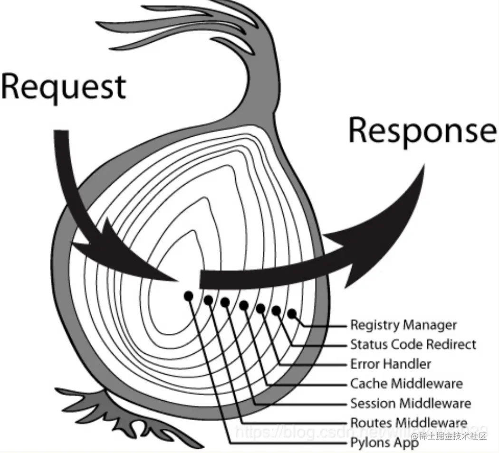
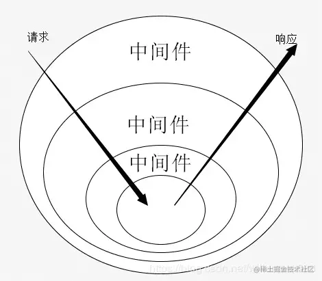

# 接入 openai 搭建一个聊天网站

## 需求

1. 支持聊天，流式返回聊天内容
2. 数据库存储聊天记录

满足以上需求需要选择以下技术栈，并在各个技术栈做重要功能的实现

### react

1.  openai 返回的消息除了文本还有图片，和代码块，为了展示这些类型的消息，openai 是用 markdwon 的格式返回的，前端需要做 markdwon 格式消息的展示，这里用的`marked`

    ```typescript
    // 这里是代码块高亮的插件
    const plugin = markedHighlight({
      langPrefix: 'hljs language-',
      highlight(code, lang) {
        if (!code && !lang) {
          return '';
        }
        if (!lang) {
          return code;
        }
        const language = hljs.getLanguage(lang) ? lang : 'plaintext';
        const codeStr = hljs.highlight(code, { language }).value;
        return codeStr;
      },
    });
    marked.use(plugin);

    marked.use({
      // 处理<br>换行
      breaks: true,
    });
    // 使得marked支持XHTML，并且使标签自动闭合
    marked.use(markedXhtml());
    // 解析邮箱的插件
    marked.use(mangle());
    // 转译字符插件，防止XSS攻击，等等
    marked.use({
      renderer: {
        html(html) {
          // 转译，防止XSS
          return he.encode(html);
        },
        text(text) {
          return text.replace(/ /g, '&nbsp;');
        },
      },
    });
    ```

2.  聊天的消息是流式返回的本身可以使用 EventSource 来接收 SSE,但是 EventSource 不直接支持自定义请求头，改用了 fetch 支持接收 sse。fetch 的 [Response.body](https://developer.mozilla.org/zh-CN/docs/Web/API/Response) 暴漏了[ReadableStream](https://developer.mozilla.org/zh-CN/docs/Web/API/ReadableStream)类型的 body 内容，下面是一个例子读取 ReadableStream 内容的例子

```typescript
const response = await fetch('https://www.example.org');
let total = 0;

// Iterate response.body (a ReadableStream) asynchronously
for await (const chunk of response.body) {
  // Do something with each chunk
  // Here we just accumulate the size of the response.
  total += chunk.length;
}

// Do something with the total
console.log(total);
```

### node

> node 这里要做几件事情：<1>给页面提供接口，以及对接 openai 提供聊天响应的内容给页面；<2>连接数据库把聊天的内容存储下来，这里用的是 mongodb,驱动库用的是 monggose，因为 monggose 自己做类型校验和连接池管理。<3>提供给用户的接口需要做认证，这里用的是 jwt，jwt 生成的 token 由页面保存在 localStorage，每次请求在 header 里都带上 token，用户校验用户。<4>完成后端项目后需要部署，部署的时候使用 pm2 来管理进程，处理错误日志和进程守护。

1.  提供接口用了 Koa 相关库，用的@koa/router 来处理 http 请求。Koa 库的 plugin 支持异步，在 plugin 中需要手动调用下一个插件，所以 Koa 的插件调用是一个洋葱模型：从第一个插件开始，到最后一个插件，然后再回到第一个插件。
<center>
  
  
</center>

2.  连接数据库用的 mongoose，因为设计数据库的时候根据不同种类的信息分为了多个数据库，所以在连接池上的设计是每个数据库都有一个连接池，用完及时关闭，这样可以避免一个数据库的连接池满了影响其他数据库的连接。也增加了效率。下面是 mongoose 一个数据库的基类

    ```typescript
    abstract class Elementary {
      protected dbName: string; // 数据库名
      protected collectionName: string; // 集合名字
      protected uri: string;
      protected connection: Connection | null;
      protected abstract model: Model<any>;
      protected abstract schema: Schema;
      constructor(options: ElementaryOptions) {
        const { dbName, collectionName, uri } = options;
        Object.defineProperties(this, {
          dbName: {
            value: dbName,
            writable: false,
            enumerable: false,
            configurable: false,
          },
          collectionName: {
            value: collectionName,
            writable: false,
            enumerable: false,
            configurable: false,
          },
          uri: {
            value: sanitizeSlashes(`${uri}/${dbName}`),
            writable: false,
            enumerable: false,
            configurable: false,
          },
        });
      }
      connect() {
        const { uri } = this;
        // 创建连接
        // authSource这里代表验证的数据库是什么，一般是admin,在admin里创建各种权限的用户
        this.connection = createConnection(uri, { ...(authSource ? { authSource } : {}) });
        // 创建并连接集合模型
        this.model = this.connection.model(this.collectionName, this.schema);
      }
      checkConnection() {
        if (!this.connection || this.connection.readyState === 0) {
          this.connect();
        }
      }
      async onError(cb: (err: any) => void) {
        this.checkConnection();
        this.connection?.on('error', cb);
      }
      async close() {
        await this.connection?.close();
        this.connection = null;
      }
      async drop() {
        this.checkConnection();
        const { model } = this;
        const number = await model.count();
        // 存在才能删除，否测会报错
        if (number) {
          return await model.collection.drop();
        }
      }
    }
    // 在派生类中执行数据库操作的方法增加这个装饰器，如果数据库连接断开，那么会自动连接
    function preCheckConnection(...arg: any[]) {
      // 装饰器函数
      const [, , descriptor] = arg;
      const originalMethod = descriptor.value;
      descriptor.value = function (...args: any[]) {
        (this as any).checkConnection();
        // @resolve: 如果是异步，那么将返回promise,没有改变函数的返回结果。
        return originalMethod.apply(this, args);
      };
    ```

    常用数据库操作：

    - 简单：增加一条文档：

      ```typescript
      const data = new model(_baseInfo);
      await data.save();
      ```

    - 复杂：给文档里数组增加一条数据，如果有这个文档就插入，如果没有插入数据并设置其他字段：

      ```typescript
      await model.updateOne(
        { uuid: options.uuid },
        {
          $push: { topics: topic }, // 添加到文档的 topics 数组
          $setOnInsert: { uuid: options.uuid }, // 在增加一个文档时设置 uuid.(插入文档时才会生效，和 upsert 联动)
        },
        { upsert: true }, // 没有该文档就增加一个文档
      );
      ```

    - 简单：查询数据：

      ```typescript
      await model.findOne({ email });
      ```

    - 复杂：查询某个文档的 topics 数组字段，并且针对 topics 数组进行排序，并且去掉 topics 中每一项嵌套文档的 messages 字段，最后返回的数据是一个数组，数组的每一项是 topics 数组的每一项，这里用到了 mongodb 的聚合查询：

    ```typescript
    // 聚合通道的任何操作不会改变数据库，只是在内存中变量的变换
    await model.aggregate([
      {
        $match: { uuid }, // 匹配集合里的某个文档
      },
      {
        $unwind: '$topics', //展开topics数组字段，分成多个文档
      },
      {
        $replaceRoot: { // 移动根节点在topics数组拆分成的多个文档
          newRoot: '$topics',
        },
      },
      {
        $sort: { lastUpdateTime: -1 }, // 按时间倒序排序
      },
      {
        $addFields: { // 添加一个字段，$toLong是时间格式转成时间戳, $toString是把ObjectId转成字符串
          lastUpdateTime: { $toLong: '$lastUpdateTime' },
          createTime: { $toLong: '$createTime' },
          id: { $toString: '$_id' },
          messagesCount: { $size: '$messages' },
        },
      },
      {
        $project: {// 投影：确定哪些字段保留，哪些字段丢弃
          _id: 0,
          messages: 0,
        },
      },

    ]);
    }
    ```

    - 简单：更新数据

      ```typescript
      await model.updateOne({ uuid }, { $set: { lastUpdateTime: Date.now() } });
      ```

    - 复杂：更新数据

      ```typescript
      // 需要再次测试
      await model.updateOne(
        {
          uuid,
          'topics._id': new mongoose.Types.ObjectId(topicId),
          'topics.messages._id': new mongoose.Types.ObjectId(messageId),
        },
        {
          $set: {
            'topics.$[topic].messages.$[elem]': newMessage,
          },
        },
        {
          arrayFilters: [
            { 'topic._id': new mongoose.Types.ObjectId(topicId) },
            { 'elem._id': new mongoose.Types.ObjectId(messageId) },
          ],
        },
      );
      ```

3.  认证用户

    > 认证用户的常见几种方式：[OAuth 认证](https://www.rfcreader.com/#rfc6749)，主要用于第三方应用程序认证；Cookie-Session 认证：用户登录后，服务端生成一个 session，然后把 session 的 id 保存在 cookie 里，每次请求都带上 cookie，服务端根据 cookie 里的 session id 找到对应的 session，然后根据 session 里的信息判断用户是否登录；[JWT 认证](https://www.rfcreader.com/#rfc7519)：用户登录后，服务端生成一个 jwt，然后把 jwt 保存在 localStorage 里，每次请求都带上 jwt，服务端根据 jwt 里的信息判断用户是否登录。

    > jwt 的优势是服务端不需要存储凭证，减少了服务端的存储压力，jwt 的缺点是服务端无法主动注销用户，只能等待 jwt 过期，或者用户手动清除 jwt。cookie session 的优势是服务端可以主动注销用户，缺点是服务端需要存储凭证，增加了服务端的存储压力，跨域限制，分布式环境同步数据问题。

    基于以上调研使用 jwt. 生成的 demo: eyJhbGciOiJIUzI1NiIsInR5cCI6IkpXVCJ9.`eyJlbWFpbCI6IjEzNTgzMTA2NzcxQDE2My5jb20iLCJuYW1lIjp7ImZpcnN0TmFtZSI6IuWImCIsImxhc3ROYW1lIjoi5b-X5rSLIn0sInV1aWQiOiJiMWZlZTI5Ny0yMGEwLTQ4MzEtODhlYy0wY2FkM2M2ODYyN2UiLCJpZCI6IjY1NDBiOGY0ZDQ4OGNmZGQ5NWZhNGJkOSIsImlhdCI6MTcwMDQ1MDM3MywiZXhwIjoxNzAwNDUzOTczfQ.nUwSUzSEFUmaCuc9o2BsGbs6ldgFCplIM8RMUf0u1ys`

    - [jwt 介绍](https://jwt.io/introduction)
    - [jwt 解码](https://jwt.io/)

    jwt 生成的 token 包含三部分：header.payload.signature,header 和 payload 都是 json 对象，signature 是对前两部分加上密匙的签名，签名的目的是为了防止 token 被篡改，签名的算法是 header 里的 alg 字段指定的算法，一般是 HMAC SHA256 或者 RSA，这里用的是 HMAC SHA256，签名的时候需要一个密钥，这个密钥只有服务端知道，所以服务端可以根据密钥生成签名，然后把签名和 token 一起返回给客户端，客户端每次请求都带上 token，服务端根据密钥和 token 里的 header 和 payload 生成签名，然后和 token 里的签名比较，如果一样说明 token 没有被篡改，否则说明 token 被篡改了。但是 jwt 最好不要作为敏感信息的凭证，因为 jwt 生成的 payload 部分知识简单的 base64，是可以解码的，所以最好再做一层加密，把加密后的字符串作为 Token 发给客户端。

4.
